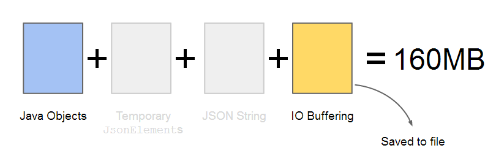
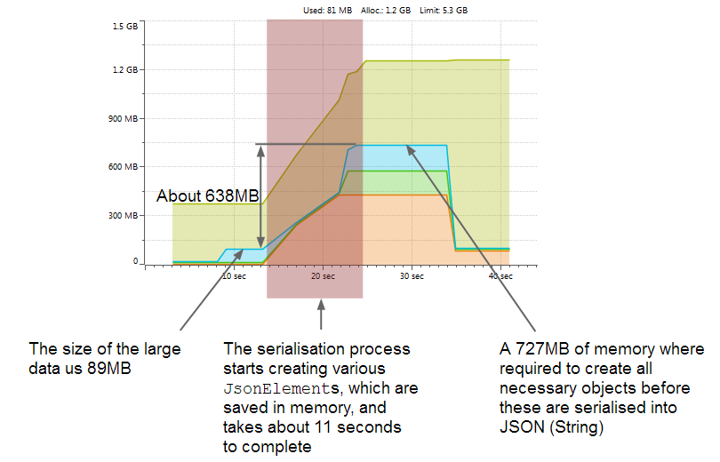

Programs work well when dealing with a considerable amount of data, but their performance tend to degrade when dealing with large volumes of data.  Resources are cheaper than ever, but this does not mean that we can have inefficient programs.  Dealing with large amounts of data brings several challenges, even if the task is as simple as parsing some Java objects into JSON strings.  Inefficient use of resources (mainly CPU and memory) can make a program wasting more than 5 times the memory when compared with a more efficient one.  This means that one program makes use of 1G of memory, while the inefficient one requires 5G of memory to perform the same task.

All code listed below is available at: [https://github.com/javacreed/gson-typeadapter-example-serialise-large-objects/](https://github.com/javacreed/gson-typeadapter-example-serialise-large-objects/).  Most of the examples will not contain the whole code and may omit fragments which are not relevant to the example being discussed. The readers can download or view all code from the above link.

In this article we will see how to serialise large objects, similar to the one shown next, using the following techniques.

1. `JsonSerializer` ([Java Doc](https://google-gson.googlecode.com/svn/trunk/gson/docs/javadocs/com/google/gson/JsonSerializer.html))
1. `TypeAdapter` ([Java Doc](https://google-gson.googlecode.com/svn/trunk/gson/docs/javadocs/com/google/gson/TypeAdapter.html))
1. `TypeAdapter` and Streams
1. `JsonSerializer` and Streams

These techniques are analysed and compared against each other using a Java Profiler.  The profiler used in this article is YourKit ([Homepage](http://www.yourkit.com/java/profiler/)), but other profilers, such as Java VisualVM ([Homepage](http://docs.oracle.com/javase/7/docs/technotes/guides/visualvm/)), can be used to achieve the same results.  When analysing problems similar to the one discussed here always use a profiler as this will provide you with concrete numbers on which you can take a sound and informed decision.  Never guess nor rely on your instinct when trying to determine the most efficient approach.  Please note that the figures shown in this article are approximate and rounded to the nearest value.

The following Java object will be used to demonstrate the strengths and weaknesses of each technique.

```java
public class LargeData {

  private long[] numbers;

  public void create(final int length) {
    numbers = new long[length];
    for (int i = 0; i < length; i++) {
      numbers[i] = i;
    }
  }

  public long[] getNumbers() {
    return numbers;
  }
}
```

This article assumes that the reader is familiar with Gson and knows how to serialise Java Objects to JSON strings.  Readers who are not familiar with `JsonSerializer` and `TypeAdapter` are encouraged to read the following articles before proceeding with this one.

1. [Gson Serialiser Example](http://www.javacreed.com/gson-serialiser-example/)
1. [Gson TypeAdapter Example](http://www.javacreed.com/gson-typeadapter-example/)

## JsonSerializer

Consider the following implementation of `JsonSerializer`.

```java
package com.javacreed.examples.gson.part1;

import java.lang.reflect.Type;

import com.google.gson.JsonArray;
import com.google.gson.JsonElement;
import com.google.gson.JsonObject;
import com.google.gson.JsonPrimitive;
import com.google.gson.JsonSerializationContext;
import com.google.gson.JsonSerializer;

public class LargeDataSerialiser implements JsonSerializer<LargeData> {

  @Override
  public JsonElement serialize(final LargeData data, final Type typeOfSrc, final JsonSerializationContext context) {
    final JsonArray jsonNumbers = new JsonArray();
    for (final long number : data.getNumbers()) {
      jsonNumbers.add(new JsonPrimitive(number));
    }

    final JsonObject jsonObject = new JsonObject();
    jsonObject.add("numbers", jsonNumbers);
    return jsonObject;
  }
}
```

This is a fairly simple implementation that formats our Java object into a JSON array wrapped within a JSON objects.  All examples will produce the same result.  The following example creates and configures all objects and initialise our `LargeData` instance with `10485760` elements.

```java
package com.javacreed.examples.gson.part1;

import java.io.File;
import java.io.IOException;
import java.io.PrintStream;

import com.google.gson.Gson;
import com.google.gson.GsonBuilder;

public class Main {
  public static void main(final String[] args) throws IOException {
    /* Configure GSON */
    final GsonBuilder gsonBuilder = new GsonBuilder();
    gsonBuilder.registerTypeAdapter(LargeData.class, new LargeDataSerialiser());
    gsonBuilder.setPrettyPrinting();

    final Gson gson = gsonBuilder.create();

    final LargeData data = new LargeData();
    data.create(10485760);

    final String json = gson.toJson(data);

    final File dir = new File("target/part1");
    dir.mkdirs();

    try (PrintStream out = new PrintStream(new File(dir, "output.json"), "UTF-8")) {
      out.println(json);
    }

    System.out.println("Done");
  }
}
```

This example, first creates the Java objects, then converts it into a JSON string and finally writes this to a file.  The following figure shows the memory and time required by this approach.


The large Java data object requires 89MB of memory.  The serialisation process to convert from Java objects to JSON string takes about 16 seconds and requires more than 1GB of memory.  Therefore, in order to serialise 1MB of data we need a working space of approximately 11MB.  This is quite a big ratio because the overhead of such operation is approximately 1 to 11.  In this example we have an overhead of 1GB of memory.  The following image shows the stages involved in this operation.


There are four stages, one of which (the IO buffering) is not used in this example and this this stage is greyed out.  It starts with our Java objects (shown in blue), then a new set of objects are created by the the `LargeDataSerialiser` class (shown in red).  These objects are then converted into JSON string (shown in green) before it is saved as a file.  This example makes use of `PrintStream` ([Java Doc](http://docs.oracle.com/javase/7/docs/api/java/io/PrintStream.html)) to write the output to file without using any buffering.  That is why the IO buffering is greyed out, as this approach is not buffering the data.

This approach is simple, but very inefficient as we will see when we discuss the next approaches.  Its main weakness is the second layer, which is costing a considerable amount of resources (CPU and memory).  This layer can be avoided by using an instance of `TypeAdapter` instead of `JsonSerializer`.

## TypeAdapter

The `TypeAdapter` does not make use of a middle layer as described in the article Gson TypeAdapter Example ([article](http://www.javacreed.com/gson-typeadapter-example/)).  Instead, it converts the Java objects directly to JSON.  This makes it more efficient than its counterpart.

```java
package com.javacreed.examples.gson.part2;

import java.io.IOException;

import com.google.gson.TypeAdapter;
import com.google.gson.stream.JsonReader;
import com.google.gson.stream.JsonWriter;

public class LargeDataTypeAdapter extends TypeAdapter<LargeData> {

  @Override
  public LargeData read(final JsonReader in) throws IOException {
    throw new UnsupportedOperationException("Coming soon");
  }

  @Override
  public void write(final JsonWriter out, final LargeData data) throws IOException {
    out.beginObject();
    out.name("numbers");
    out.beginArray();
    for (final long number : data.getNumbers()) {
      out.value(number);
    }
    out.endArray();
    out.endObject();
  }
}
```

The above example will produce the same output before.

```java
package com.javacreed.examples.gson.part2;

import java.io.File;
import java.io.IOException;
import java.io.PrintStream;

import com.google.gson.Gson;
import com.google.gson.GsonBuilder;

public class Main {
  public static void main(final String[] args) throws IOException {
    /* Configure GSON */
    final GsonBuilder gsonBuilder = new GsonBuilder();
    gsonBuilder.registerTypeAdapter(LargeData.class, new LargeDataTypeAdapter());
    gsonBuilder.setPrettyPrinting();

    final Gson gson = gsonBuilder.create();

    final LargeData data = new LargeData();
    data.create(10485760);

    final String json = gson.toJson(data);

    final File dir = new File("target/part2");
    dir.mkdirs();

    try (PrintStream out = new PrintStream(new File(dir, "output.json"), "UTF-8")) {
      out.println(json);
    }

    System.out.println("Done");
  }
}
```

This example, first creates the Java objects, then converts it to a JSON string and finally writes this to a file.  The following figure shows the memory and time required by this approach.


The large data object requires 89MB of memory, same as before.  The serialisation process to convert from Java objects to JSON string takes about 4 seconds and requires about 650MB of memory.  Therefore, in order to serialise 1MB of data we need a working space of approximately 7.5MB.  This is less than the previous example, but still a bit high.  In this example we managed to reduce the overhead by half but it is still quite high.  The following image shows the stages involved in this operation.


Note that we have only two stages now and the other two stages are greyed out.  The second layer, coloured in red in the previous example, is not involved any more and this reduced a considerable amount of memory.  It starts with our Java objects, then converts these directly into JSON string before it is saved as a file. This example too makes use of `PrintStream` to write the output to file without using any IO buffering.  That is why the IO buffering is still greyed out.

This approach is simple too, but somewhat inefficient as we will see in the next approach.  Its main weakness is that the whole JSON string is first buffered in memory (represented as the third stage and shown in green) before this is written to file, which is costing a considerable amount of resources (mainly memory).  This layer can be avoided too, by writing the output directly to the file (or any `OutputStream` ([Java Doc](http://docs.oracle.com/javase/7/docs/api/java/io/OutputStream.html)) or `Writer` ([Java Doc](http://docs.oracle.com/javase/7/docs/api/java/io/Writer.html))), rather than buffering the whole amount.

## TypeAdapter and Streams

The `TypeAdapter` implementation does not need to be changed and thus, we will not show it in this section.  We only need to change the way we are using Gson, in the `main()` method.

```java
package com.javacreed.examples.gson.part3;

import java.io.BufferedWriter;
import java.io.File;
import java.io.FileOutputStream;
import java.io.IOException;
import java.io.OutputStreamWriter;

import com.google.gson.Gson;
import com.google.gson.GsonBuilder;

public class Main {
  public static void main(final String[] args) throws IOException {
    /* Configure GSON */
    final GsonBuilder gsonBuilder = new GsonBuilder();
    gsonBuilder.registerTypeAdapter(LargeData.class, new LargeDataTypeAdapter());
    gsonBuilder.setPrettyPrinting();

    final Gson gson = gsonBuilder.create();

    final LargeData data = new LargeData();
    data.create(10485760);

    final File dir = new File("target/part3");
    dir.mkdirs();

    try (BufferedWriter out = new BufferedWriter(new OutputStreamWriter(new FileOutputStream(new File(dir,
        "output.json")), "UTF-8"))) {
      gson.toJson(data, out);
    }

    System.out.println("Done");
  }
}
```

This example, first creates the Java objects and converts these to JSON string and immediately writes this to the output.  The following figure shows the memory and time required by this approach.


The large data object requires 89MB of memory, same as before.  The serialisation process to convert from Java objects to JSON string takes about 3 seconds and requires approximately 160MB of memory.  Therefore, in order to serialise 1MB of data we need a working space of approximately 2MB.  This is far less than both previous examples.  In this example we managed to reduce the overhead to a low of 80MB.  The following image shows the stages involved in this operation.



This approach still uses two stages.  The third layer, coloured in green in the previous example, is removed.  This example makes use of IO buffering as shown in the above image.  This new layer represents the IO buffering which too takes some memory.  While one can be tempted to reduce or remove the buffering altogether, doing so may have performance penalties and it is not recommended.

One thing to take from this approach is that this improvement was not related to Gson, but instead it relates to the way we used it.  Many developers complain about a library, or some code written by others, and most of these complaints are unfounded, due to circumstances like these.  Knowing how to best use an API is very important.  In this case, writing the output directly to the file made our approach both faster and more memory efficient, without compromising functionality.

## JsonSerializer and Streams

For completeness we will see what affects, writing the output directly to the file has on the version that uses an instance of `JsonSerializer`.  The `JsonSerializer` code is as before and thus omitted.

```java
package com.javacreed.examples.gson.part4;

import java.io.BufferedWriter;
import java.io.File;
import java.io.FileOutputStream;
import java.io.IOException;
import java.io.OutputStreamWriter;

import com.google.gson.Gson;
import com.google.gson.GsonBuilder;

public class Main {
  public static void main(final String[] args) throws IOException {
    /* Configure GSON */
    final GsonBuilder gsonBuilder = new GsonBuilder();
    gsonBuilder.registerTypeAdapter(LargeData.class, new LargeDataSerialiser());
    gsonBuilder.setPrettyPrinting();

    final Gson gson = gsonBuilder.create();

    final LargeData data = new LargeData();
    data.create(10485760);

    final File dir = new File("target/part4");
    dir.mkdirs();

    try (BufferedWriter out = new BufferedWriter(new OutputStreamWriter(new FileOutputStream(new File(dir,
        "output.json")), "UTF-8"))) {
      gson.toJson(data, out);
    }

    System.out.println("Done");
  }
}
```

This example, first creates the Java objects, then converts it to a JSON string and finally writes this to a file.  The following figure shows the memory and time required by this approach.



The large data object requires 89MB of memory, same as before.  The serialisation process to convert from Java objects to JSON string takes about 11 seconds and requires about 730MB of memory.  Therefore, in order to serialise 1MB of data we need a workspace of approximately 8MB.  This ratio is quite high when compared with the previous one.  In this example we have an overhead of 640MB of memory.  The following image shows the stages involved in this operation.


Note that we are now using three stages.  It starts with our Java objects, then a new set of objects are created by the the `LargeDataSerialiser` class.  These objects are then saved as a file, skipping the creating of the JSON string.

As expected this approach requires a considerable amount of memory due to its middle layer where a new set of Java objects are created before these are then written to the output.

## Conclusion

In this article we compared two Gson approaches to serialise large Java objects and also compares various ways how these can be used.  The approach that yielded the best results was the third approach where we reduced the waste to a minimum.  This decision could only be made after profiling all approaches and understanding how we could improve them.  It is imperative to profile before making such decisions and what worked well in this example, may not yield the same results in a different context.  Remember that "_premature optimisation is the root of all evil_" (Knuth, Donald (December 1974) "_Structured Programming with go to Statements_" [ACM Journal Computing Surveys 6 (4): 268</a>](http://cs.sjsu.edu/~mak/CS185C/KnuthStructuredProgrammingGoTo.pdf)).
